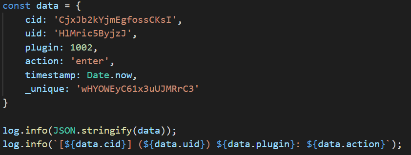
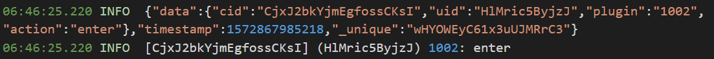
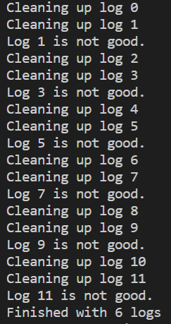
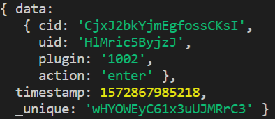

# simple-node-logger Parser
Turn your logs into insights. This parser turns your log file into an array of objects.

### Installation
To install this project you can run:

`npm install`

### Dependencies
This project uses [axios](https://github.com/axios/axios) to fetch the log. The log is generated through the use of [simple-node-logger](https://github.com/darrylwest/simple-node-logger).

### Usage

Clone this repo and run `npm run parser`

`https://github.com/radihuq/simple-node-logger-parser.git`

The parser will remove the timestamps from the log and get rid of any empty lines. It will then `JSON.parse` each object and push it to a master array.

#### Input

1. Stringify your data:

        const data = {
            cid: 'CjxJb2kYjmEgfossCKsI',
            uid: 'HlMric5ByjzJ',
            plugin: 1002,
            action: 'enter',
            timestamp: Date.now,
            _unique: 'wHYOWEyC61x3uUJMRrC3'
        }

2. Log your data:

        log.info(JSON.stringify(data));
        log.info(`[${data.cid}] (${data.uid}) ${data.plugin}: ${data.action}`);

*Data input & calling simple-node-logger*

*Example of logged data*

#### Output

3. Run this parser

The output will be an array of JavaScript objects.

*Console while parser is running*

*Example of data output*

### Author
This parser was created by Radiun Huq. You can reach him at:

`Email: radi@mrhuq.com`

`Twitter: @radiunhuq`